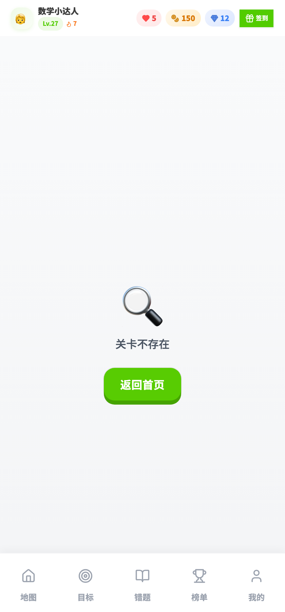
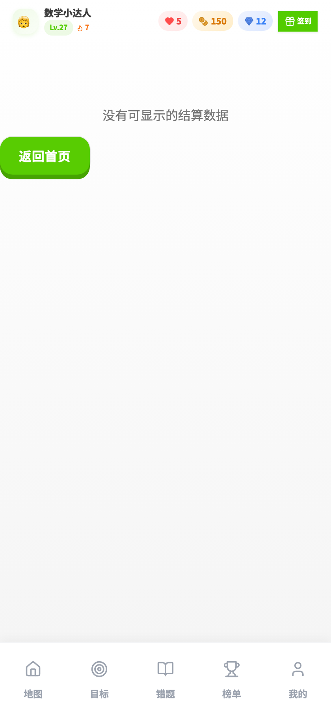
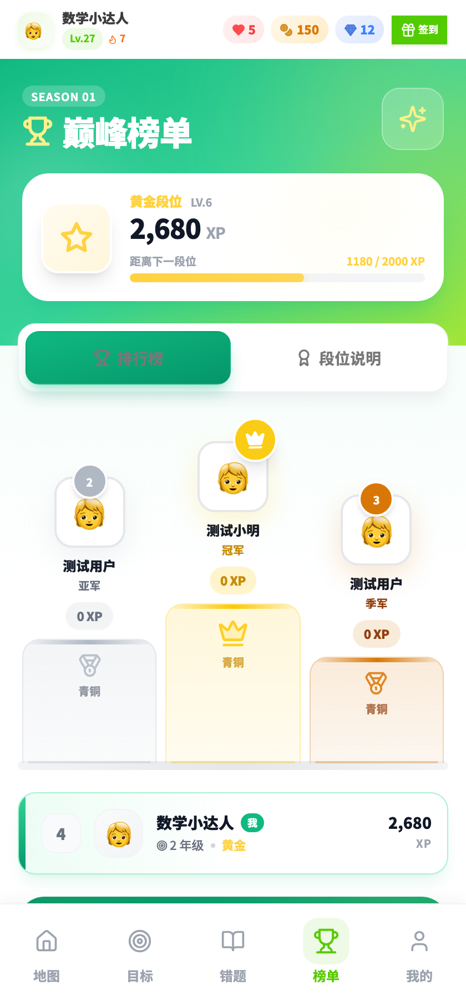
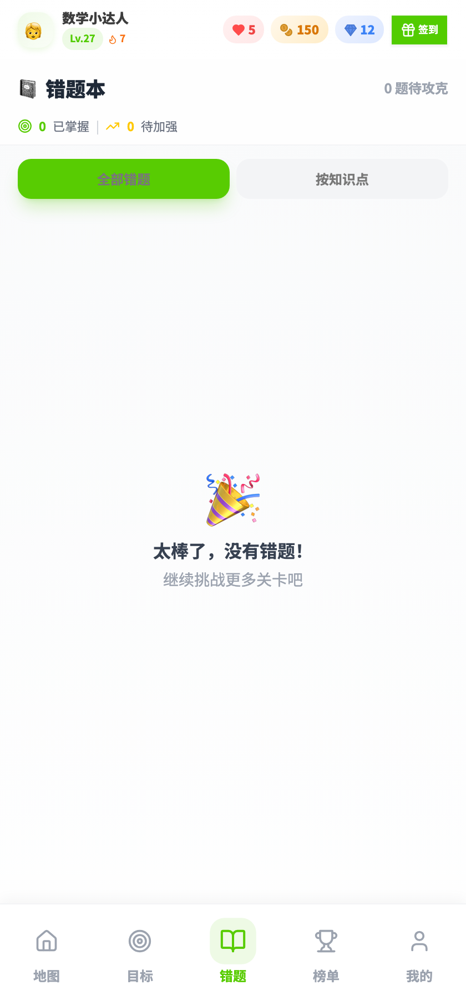
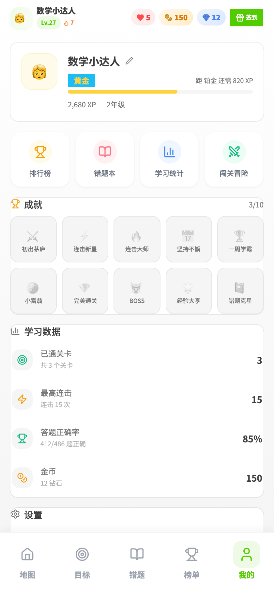
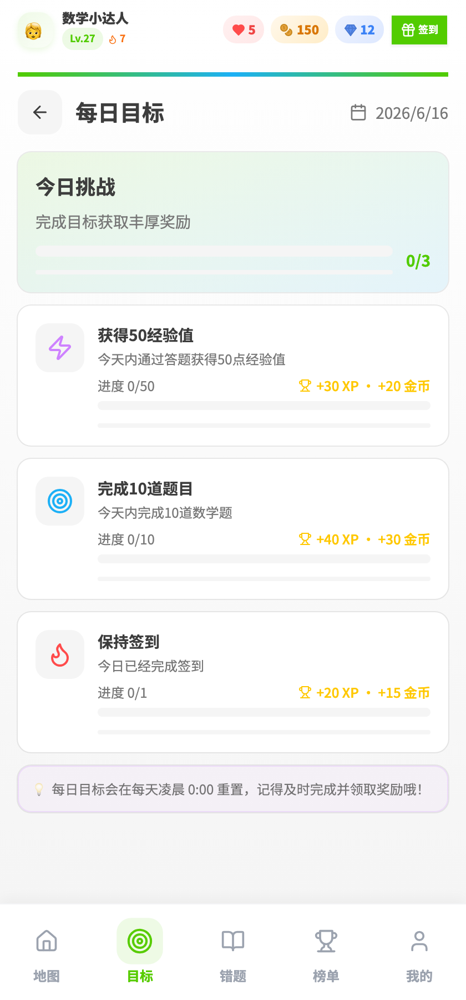
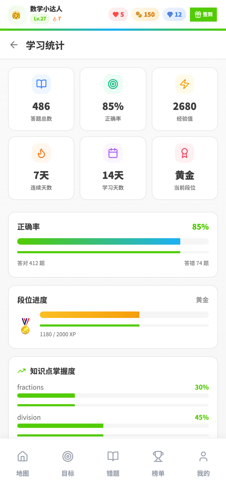
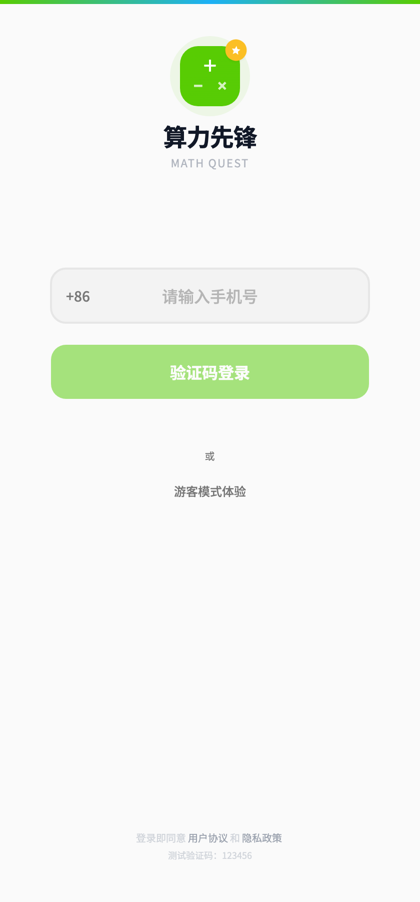
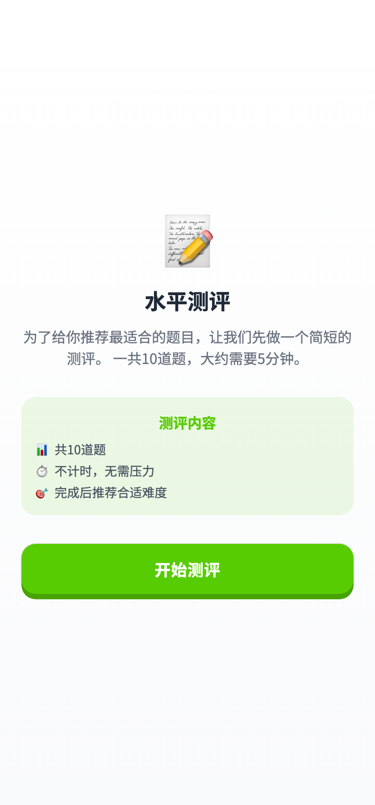

# 🧮 算力先锋 MathQuest - 多邻国式数学学习应用

一款基于 **React + TypeScript + Vite** 构建的移动优先数学学习应用，采用类似多邻国的游戏化学习体验，帮助用户通过闯关式答题提高数学能力。

---

## 📱 产品介绍

**算力先锋**是一款面向小学生的数学学习应用，通过以下核心设计理念，让学习变得更有趣：

| 设计理念 | 实现方式 |
|---------|---------|
| **游戏化学习** | 关卡地图、星级评价、成就系统 |
| **即时反馈** | 连击系统、动画反馈、音效振动 |
| **个性化推荐** | 掌握度算法、智能错题复习 |
| **社交激励** | 排行榜、每日目标、签到打卡 |
| **多币种经济** | 生命值❤️、金币🪙、钻石💎 |

通过简洁的界面、丰富的动画和即时的正反馈，让孩子在玩乐中提升数学能力。

---

## 🏗️ 技术架构

### 前端架构

```
┌─────────────────────────────────────────────────────────────┐
│                        前端架构                              │
├─────────────────────────────────────────────────────────────┤
│  React 18 + TypeScript 5 + Vite 5                           │
│                                                             │
│  ┌──────────┐  ┌──────────┐  ┌──────────┐  ┌──────────┐   │
│  │  Home    │  │  Battle  │  │  Result  │  │  Leaderboard│ │
│  │ (地图页) │  │ (战斗页) │  │ (结果页) │  │ (排行榜)  │   │
│  └──────────┘  └──────────┘  └──────────┘  └──────────┘   │
│                                                             │
│  ┌──────────┐  ┌──────────┐  ┌──────────┐  ┌──────────┐   │
│  │ Mistakes │  │  Profile │  │  Daily   │  │   Stats  │   │
│  │ (错题本) │  │ (个人中心) │ (每日目标) │ (统计页)   │   │
│  └──────────┘  └──────────┘  └──────────┘  └──────────┘   │
│                                                             │
│  ┌───────────────────┐   ┌───────────────────┐             │
│  │ Zustand 状态管理   │   │  Framer Motion 动画 │             │
│  │ (用户 / 会话 /     │   │ (过渡动画 / 粒子效果) │             │
│  │  持久化存储)      │   │                    │             │
│  └───────────────────┘   └───────────────────┘             │
│                                                             │
│  ┌───────────────────┐   ┌───────────────────┐             │
│  │ shadcn/ui 组件库   │   │  TailwindCSS 样式    │             │
│  │ (Button / Dialog  │   │ (自定义主题色 /      │             │
│  │  / Sheet / Toast) │   │  响应式布局)        │             │
│  └───────────────────┘   └───────────────────┘             │
│                                                             │
│  ┌────────────────────────────────────────────────────┐   │
│  │  React Router v6 (路由导航 + 守卫)                    │   │
│  └────────────────────────────────────────────────────┘   │
└─────────────────────────────────────────────────────────────┘
```

**前端核心依赖：**

| 技术 | 版本 | 用途 |
|-----|-----|-----|
| React | 18.3 | 组件化 UI 框架 |
| TypeScript | 5.x | 类型安全开发 |
| Vite | 5.4 | 极速构建与开发服务 |
| Zustand | 4.5 | 轻量状态管理 + Persist 持久化 |
| Framer Motion | 11.5 | 流畅动画与过渡效果 |
| React Router | 6.26 | 前端路由与守卫 |
| Tailwind CSS | 3.4 | 原子化 CSS |
| shadcn/ui | 4.11 | 高质量 UI 组件（Button/Sheet/Sonner 等）|
| lucide-react | 0.451 | 图标库 |

### 后端架构

```
┌─────────────────────────────────────────────────────────────┐
│                        后端架构                              │
├─────────────────────────────────────────────────────────────┤
│  Express 4.x + TypeScript + MySQL 8                          │
│                                                             │
│  ┌───────────────────────────────────────────────────────┐ │
│  │  Express Middleware                                    │ │
│  │  ├─ CORS (跨域支持)                                    │ │
│  │  ├─ JSON Body Parser (10MB)                            │ │
│  │  ├─ Rate Limit (全局限流 + 登录限流)                   │ │
│  │  └─ Admin Auth (管理员 JWT 守卫)                       │ │
│  └───────────────────────────────────────────────────────┘ │
│                                                             │
│  ┌─────────┐  ┌──────────┐  ┌──────────┐  ┌─────────────┐ │
│  │ /auth   │  │ /content │  │ /stats   │  │ /admin/*    │ │
│  │ 登录    │  │ 内容     │  │ 统计     │  │ 管理后台    │ │
│  │ 注册    │  │ 关卡     │  │ 看板     │  │ 题库导入    │ │
│  │ 验证    │  │ 题目     │  │          │  │ 系统配置    │ │
│  └─────────┘  └──────────┘  └──────────┘  └─────────────┘ │
│                                                             │
│  ┌───────────────────┐   ┌───────────────────┐             │
│  │  MySQL 数据存储    │   │  ioredis 缓存层   │             │
│  │ ├ users (用户表)  │   │ (会话 / 限流令牌) │             │
│  │ ├ questions (题库) │   │                    │             │
│  │ ├ levels (关卡)   │   │                    │             │
│  │ ├ sessions (答题记录)│   │                    │             │
│  │ └ achievements (成就) │   │                    │             │
│  └───────────────────┘   └───────────────────┘             │
│                                                             │
│  ┌───────────────────────────────────────────────────────┐ │
│  │ 降级方案：内存模式 (MySQL 不可用时自动回退)            │ │
│  └───────────────────────────────────────────────────────┘ │
└─────────────────────────────────────────────────────────────┘
```

**后端核心依赖：**

| 技术 | 版本 | 用途 |
|-----|-----|-----|
| Express | 4.22 | HTTP 服务框架 |
| TypeScript | 5.x | 类型安全开发 |
| MySQL | 8.x (mysql2 v3.22) | 关系数据库 |
| ioredis | 5.11 | 缓存与会话管理 |
| express-rate-limit | 8.5 | API 限流 |
| PM2 | 7.0 | 进程管理 & 部署 |

---

## 🏢 业务架构

```
                    ┌─────────────────┐
                    │   用户接入层     │
                    │  (登录 / 注册)   │
                    └────────┬────────┘
                             │
                    ┌────────▼────────┐
                    │   用户画像层     │
                    │ (测评 / Onboarding)│
                    └────────┬────────┘
                             │
                    ┌────────▼────────┐
                    │   核心学习层     │
                    │ ┌──────────────┐ │
                    │ │ 地图关卡系统   │ │
                    │ │ 战斗答题系统   │ │
                    │ │ 掌握度追踪    │ │
                    │ └──────────────┘ │
                    └────────┬────────┘
                             │
          ┌──────────────────┼───────────────────┐
          │                  │                   │
   ┌──────▼─────┐   ┌──────▼─────┐   ┌──────▼─────┐
   │ 激励反馈层 │   │ 错题强化层 │   │ 社交激励层 │
   │ ┌────────┐ │   │ ┌────────┐ │   │ ┌────────┐ │
   │ │ 成就系统│ │   │ │ 错题本 │ │   │ │ 排行榜 │ │
   │ │ 每日目标│ │   │ │ 智能复习│ │   │ │ 好友PK │ │
   │ │ 签到奖励│ │   │ │          │ │   │ │          │ │
   │ │ 资源经济│ │   │ │          │ │   │ │          │ │
   │ └────────┘ │   │ └────────┘ │   │ └────────┘ │
   └───────────┘   └───────────┘   └───────────┘
```

**核心业务模块说明：**

| 模块 | 说明 | 关键机制 |
|-----|-----|---------|
| **用户认证** | 手机号 + 验证码登录，支持 Token 自动续期 | JWT Token / 6位随机验证码 / 防刷限流 |
| **能力测评** | 首次使用进行能力评估，自动推荐难度 | 智能打分算法 / 推荐难度等级 |
| **学习地图** | Z字形关卡地图，根据年级切换主题色 | 解锁机制 / 掌握度进度环 / 动态生成路径 |
| **战斗答题** | 核心答题界面，即时反馈 + 连击系统 | 粒子爆裂动画 / Combo 计数 / 声音振动反馈 |
| **资源经济** | 三币种体系（生命/金币/钻石），各有获取途径与用途 | 自动恢复 / 关卡奖励 / 成就解锁 |
| **错题本** | 自动收录错题，支持按时间/知识点筛选复习 | 智能复习推荐 / 错题重做 |
| **成就系统** | 多维度成就奖励，解锁获得钻石 | 连续学习 / 累计答题 / 满分成就 / 速度达人 |
| **每日目标** | 今日任务清单，完成领取奖励 | 目标进度追踪 / 一键领取 |
| **排行榜** | 好友/全国/年级多维度排名 | 积分算法 / 实时更新 |
| **统计分析** | 个人学习数据总览，可视化展示 | 掌握度雷达图 / 错题趋势 / 时间分布 |
| **管理后台** | 题库管理、用户管理、配置管理、数据统计 | 独立 JWT 鉴权 / CRUD 操作 |

---

## ✨ 功能点一览

### 🎮 核心学习体验

| 功能 | 描述 |
|-----|-----|
| **闯关式学习地图** | Z字形关卡布局，支持1-3年级切换主题配色（薄荷绿/桃粉/薰衣草紫） |
| **动态关卡解锁** | 完成当前关卡自动解锁下一关，掌握度进度环可视化 |
| **沉浸式答题体验** | 大号数字键盘 / 选项卡双模式，支持自定义数字输入和选择题 |
| **即时视觉反馈** | 答对粒子爆裂动画 + 绿色高亮，答错抖动 + 红色提示 |
| **连击奖励系统** | 连续答对触发 Combo 数字动画，连击阈值可配置 |
| **星级评价机制** | 答题准确度 + 速度综合评分 1-3 星，影响奖励 |
| **生命值系统** | 答错扣 1 心，上限可配置（默认 5），定时自动恢复 |

### 💎 激励与成就

| 功能 | 描述 |
|-----|-----|
| **三币种经济** | ❤️ 生命值（答题消耗）、🪙 金币（关卡奖励）、💎 钻石（稀有成就） |
| **签到打卡** | 每日签到获得随机金币/钻石奖励，自动记录签到日期 |
| **每日目标** | 今日任务清单（答题数量 / 通关关卡 / 连击挑战），进度可视化 |
| **成就系统** | 多维度成就（学习时长 / 累计答题 / 满分达成 / 连胜纪录等） |
| **等级成长** | XP 经验值积累，等级徽章显示在状态栏和个人中心 |
| **连续学习** | 🔥 Streak 连续学习天数记录，激励用户坚持 |

### 📊 学习分析

| 功能 | 描述 |
|-----|-----|
| **掌握度追踪** | 按知识点维度追踪掌握度，指导后续题目生成权重 |
| **智能错题本** | 自动收录错题，按时间/知识点分组，支持一键重做 |
| **个人统计页** | 累计答题数 / 正确率 / 学习时长 / 最近趋势图 |
| **个性化题目生成** | 根据掌握度 + 错题历史动态生成关卡题目 |

### 👥 社交与排行

| 功能 | 描述 |
|-----|-----|
| **多维度排行榜** | 好友榜 / 全国榜 / 年级榜，支持切换查看 |
| **个人主页** | 昵称、头像、等级、学习数据一目了然 |
| **头像选择** | 内置数学表情符号头像库，自定义个人形象 |

### 📱 产品体验细节

| 功能 | 描述 |
|-----|-----|
| **移动优先设计** | 专为手机竖屏优化，最大宽度 420px，适配多种机型 |
| **音效与振动** | 答题/连击/解锁均有音效 + 触觉反馈，可在设置中开关 |
| **平滑动画过渡** | Framer Motion 驱动所有页面切换和微动画 |
| **状态栏胶囊** | 顶部资源快捷入口，点击展开详情 Sheet 弹窗 |
| **主题化配色** | 按年级切换整体配色，薄荷绿(1年级)/桃粉(2年级)/薰衣草紫(3年级) |
| **离线可用** | 前端本地状态持久化，后端不可用时降级到本地数据 |

### 🛠️ 管理后台

| 功能 | 描述 |
|-----|-----|
| **题库管理** | 增删改查题目，支持批量导入/导出 |
| **用户管理** | 查看用户列表、学习数据、封禁/解封操作 |
| **数据看板** | 注册数 / 活跃用户 / 答题总量 / 趋势图表 |
| **系统配置** | 动态调整心数恢复时间、连击阈值、奖励系数等 |
| **独立鉴权** | 管理员账号独立，JWT Token 鉴权隔离用户登录 |

---

## 🌆 真机演示预览

### 🏠 首页学习地图


Z字形关卡布局，当前关卡脉动光环提示，已完成关卡显示星级评价。

### ⚔️ 答题战斗界面


大号数字键盘输入，即时视觉反馈，连击奖励系统。

### 📊 结算结果页


关卡总结：星级评价、获得经验/金币、新成就解锁提示。

### 🏆 排行榜


好友榜 / 全国榜 / 年级榜 多维度榜单切换。

### 📖 错题本


自动收录错题，按时间/知识点分组，支持一键重做。

### 👤 个人中心


学习数据总览，成就徽章墙，个人资料编辑。

### 🎯 每日目标


今日任务清单：答题数量、通关关卡、连击挑战。

### 📈 学习统计


累计答题、正确率、学习时长、最近趋势图表。

### 🔐 登录页面


手机号 + 验证码登录，简洁的登录体验。

### 📝 能力测评


新用户能力评估测试，智能推荐学习难度。

---

## 📐 设计规范

| 项 | 说明 |
|---|---|
| **视图模式** | 移动端竖屏设计，最佳显示宽度 420px |
| **年级主题色** | 一年级: 薄荷绿 (#4A9E8A) · 二年级: 桃粉色 (#E0896E) · 三年级: 薰衣草紫 (#8B7AB8) |
| **字体** | Geist - 现代无衬线字体 |
| **动画** | Framer Motion 过渡动画 + 粒子爆裂效果 |
| **圆角** | 组件卡片 rounded-xl / rounded-2xl / rounded-3xl |
| **视觉密度** | 舒适的留白，避免信息拥挤 |

---

## 🚀 快速开始

### 环境要求

- **Node.js**: 18+ (推荐 20+，项目自带 `node_modules` 本地 Node)
- **MySQL**: 8.0+ (可选，支持内存模式降级)
- **Redis**: 7.0+ (可选，用于缓存和限流)

### 一键启动

```bash
# 安装依赖
npm install

# 同时启动前端 + 后端
npm run dev:all

# 或单独启动
npm run dev           # 前端: http://localhost:5173
npm run dev:server    # 后端: http://localhost:3002
```

### 生产环境部署

```bash
# 构建
npm run build

# 使用 PM2 启动后端
npm install -g pm2
pm2 start ecosystem.config.cjs

# 前端静态部署 (Nginx 配置示例见 nginx/mathquest.conf)
```

### 默认管理员账号

- 登录入口: `http://localhost:5173/admin/login`
- 用户名: `admin`
- 密码: `admin123`
- ⚠️ 生产环境请立即修改默认密码

---

## 📂 项目结构

```
math-quest/
├── src/                         # 前端源码
│   ├── components/              # 通用组件
│   │   ├── ui/                 # shadcn/ui 基础组件 (Button, Sheet, Sonner...)
│   │   ├── StatusBar.tsx       # 顶部状态栏（资源胶囊 + 签到）
│   │   ├── BottomNav.tsx       # 底部导航
│   │   ├── Keypad.tsx          # 数字键盘组件
│   │   ├── ComboNumber.tsx     # 连击数字动画
│   │   ├── ParticleBurst.tsx   # 粒子爆裂动画
│   │   └── ...
│   ├── pages/                   # 页面路由
│   │   ├── Home.tsx            # 🏠 首页（关卡地图）
│   │   ├── Battle.tsx          # ⚔️ 战斗答题页
│   │   ├── Result.tsx          # 📊 结算结果页
│   │   ├── Mistakes.tsx        # 📖 错题本
│   │   ├── Leaderboard.tsx     # 🏆 排行榜
│   │   ├── DailyGoals.tsx      # 🎯 每日目标
│   │   ├── Profile.tsx         # 👤 个人中心
│   │   ├── Stats.tsx           # 📈 学习统计
│   │   ├── Login.tsx           # 🔐 登录页
│   │   ├── Assessment.tsx      # 📝 能力测评
│   │   ├── Onboarding.tsx      # 🚀 新手引导
│   │   └── admin/              # 🛠️ 管理后台（Dashboard/题库/用户/配置）
│   ├── store/                   # Zustand 状态管理
│   │   ├── useUserStore.ts     # 用户数据 + 持久化
│   │   └── useSessionStore.ts  # 答题会话状态
│   ├── services/                # API 请求封装
│   ├── utils/                   # 工具函数 (time/sound/vibrate/rank)
│   ├── data/                    # 静态数据（成就/题库）
│   └── types/                   # TypeScript 类型定义
│
├── server/                      # 后端源码
│   ├── index.ts                # Express 服务入口
│   ├── db.ts                   # MySQL 连接初始化
│   ├── routes/                 # API 路由
│   │   ├── auth.ts             # 🔐 认证接口
│   │   ├── content.ts          # 📚 内容接口 (关卡/题目)
│   │   ├── adminStats.ts       # 📊 管理员统计
│   │   ├── adminImport.ts      # 📥 导入/导出
│   │   ├── adminConfig.ts      # ⚙️ 系统配置
│   │   └── adminAccounts.ts    # 👥 账号管理
│   ├── services/                # 业务逻辑层
│   └── middleware/              # 中间件 (限流/鉴权)
│
├── nginx/                       # Nginx 配置示例
├── dist/                        # 前端构建输出
├── package.json                # 项目依赖与脚本
├── vite.config.ts              # Vite 配置 (代理/api)
├── tailwind.config.cjs         # Tailwind 主题配置
└── ecosystem.config.cjs        # PM2 生产部署配置
```

---

## 🔌 API 接口说明

### 用户认证

| 方法 | 路径 | 说明 |
|-----|------|-----|
| POST | `/api/auth/send-code` | 发送手机验证码 |
| POST | `/api/auth/verify-code` | 验证验证码 |
| POST | `/api/auth/register` | 注册新用户（完成 Onboarding） |
| POST | `/api/auth/token-login` | Token 自动登录 |
| GET | `/api/auth/user/:id` | 获取用户详情 |
| PUT | `/api/auth/user/:id` | 更新用户资料 |

### 内容服务

| 方法 | 路径 | 说明 |
|-----|------|-----|
| GET | `/api/content/levels/:grade` | 获取指定年级关卡列表 |
| GET | `/api/content/level/:levelId` | 获取关卡详情 + 题目 |
| POST | `/api/content/generate-questions` | 基于掌握度动态生成题目 |
| GET | `/api/content/achievements` | 获取成就列表 |
| GET | `/api/content/configs` | 获取系统配置 |
| POST | `/api/content/session-result` | 提交答题结果 |
| POST | `/api/content/assessment` | 提交能力测评结果 |
| GET | `/api/content/mistakes/:userId` | 获取错题列表 |

### 管理后台

| 方法 | 路径 | 说明 |
|-----|------|-----|
| POST | `/api/admin/accounts/login` | 管理员登录 |
| GET | `/api/admin/stats/dashboard` | 数据看板统计 |
| GET | `/api/admin/questions` | 题目列表 |
| POST | `/api/admin/questions` | 新增题目 |
| PUT | `/api/admin/questions/:id` | 更新题目 |
| DELETE | `/api/admin/questions/:id` | 删除题目 |
| POST | `/api/admin/import/batch` | 批量导入题目 |
| GET | `/api/admin/configs` | 配置列表 |
| PUT | `/api/admin/configs/:key` | 更新配置项 |
| GET | `/api/admin/accounts/users` | 用户列表 |
| PUT | `/api/admin/accounts/user/:id` | 操作用户（封禁/重置） |

---

## 🎨 设计风格

- **配色**: 年级主题动态切换，薄荷绿 / 桃粉 / 薰衣草紫
- **字体**: Geist（现代无衬线字体）
- **组件**: shadcn/ui 基础组件 + 业务自定义组件
- **动画**: Framer Motion 过渡 + 粒子效果
- **风格**: 扁平化卡片 + 圆润边角 (rounded-2xl/3xl) + 胶囊按钮

---

## 🔐 安全设计

| 安全点 | 实现方式 |
|-------|---------|
| **登录限流** | express-rate-limit 限制验证码发送频率 |
| **Token 机制** | 随机 Token 存储在服务端 + 前端 localStorage |
| **管理员隔离** | 独立 JWT Token，与用户 Token 体系分离 |
| **请求体大小** | JSON Body 限制 10MB，防止大请求攻击 |
| **全局错误捕获** | 未捕获异常统一处理，防止进程崩溃 |
| **数据库降级** | MySQL 不可用时自动降级为内存模式 |

---

## 🚧 后续优化方向

- [ ] **AI 题目生成**: 集成大模型，根据用户薄弱点生成个性化题目
- [ ] **好友系统**: 支持添加好友、邀请挑战、学习对比
- [ ] **知识点图谱**: 可视化展示数学知识点网络和掌握度
- [ ] **多设备同步**: 云端同步学习进度，支持手机/平板切换
- [ ] **学习报告**: 周/月学习报告，PDF 导出
- [ ] **家长模式**: 家长端查看孩子学习数据和时间管理
- [ ] **视频讲解**: 错题关联知识点讲解视频
- [ ] **离线练习**: PWA 支持，离线也能继续答题

---

## 📄 License

MathQuest © 2024-2026

Built with ❤️ for young learners.
